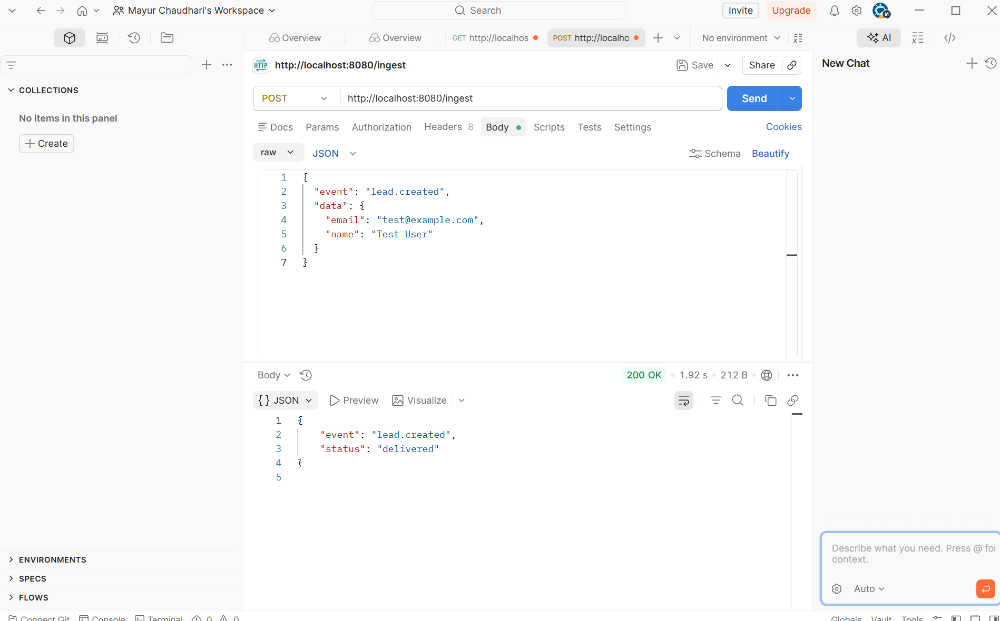
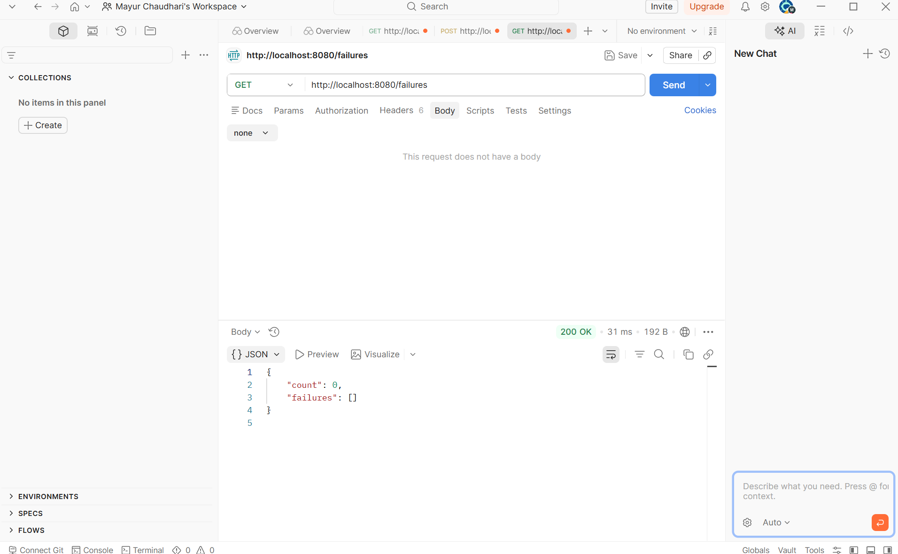
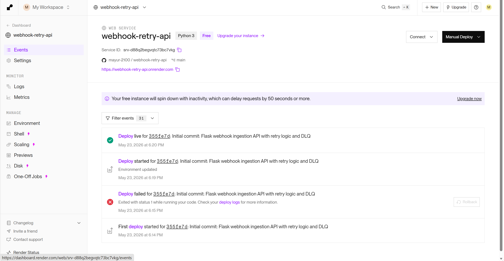

# Webhook Ingestion & Retry Queue API

A Flask-based webhook ingestion service with schema validation,
exponential backoff retry logic, and PostgreSQL-backed dead-letter
queue handling for failed payloads.

## Live Demo
- **API:** https://webhook-retry-api.onrender.com
- **Health:** https://webhook-retry-api.onrender.com/health

## What It Does
- Receives webhook payloads via `POST /ingest`
- Validates JSON schema (requires `event` and `data` fields)
- Retries failed deliveries: 1s → 5s → 30s backoff
- Logs permanently failed payloads to PostgreSQL dead-letter queue
- Exposes `GET /failures` to query all failed jobs
- Exposes `DELETE /failures/<id>` to clear resolved failures

## API Reference

### GET /health
```json
{ "status": "ok", "service": "webhook-retry-api" }
```

### POST /ingest
**Request:**
```json
{
  "event": "lead.created",
  "data": { "email": "user@example.com" }
}
```
**Success:**
```json
{ "status": "delivered", "event": "lead.created" }
```
**Failure (logged to DLQ):**
```json
{ "status": "failed", "error": "Max retries exceeded after 3 attempts" }
```

### GET /failures
```json
{
  "count": 1,
  "failures": [{
    "id": 1,
    "payload": { "event": "lead.created", "data": {} },
    "error": "Max retries exceeded after 3 attempts",
    "retry_count": 3,
    "timestamp": "2025-05-23T10:00:00"
  }]
}
```

## Screenshots

### Successful delivery


### Dead-letter queue


### Railway deployment


## Local Setup
```bash
git clone https://github.com/mayur-2100/webhook-retry-api
cd webhook-retry-api
python -m venv venv && source venv/bin/activate
pip install -r requirements.txt
cp .env.example .env
python app.py
```

## Running Tests
```bash
pytest tests/ -v
```

## Tech Stack
- Python 3.10+
- Flask + Flask-SQLAlchemy
- PostgreSQL (Railway)
- Gunicorn
- pytest
